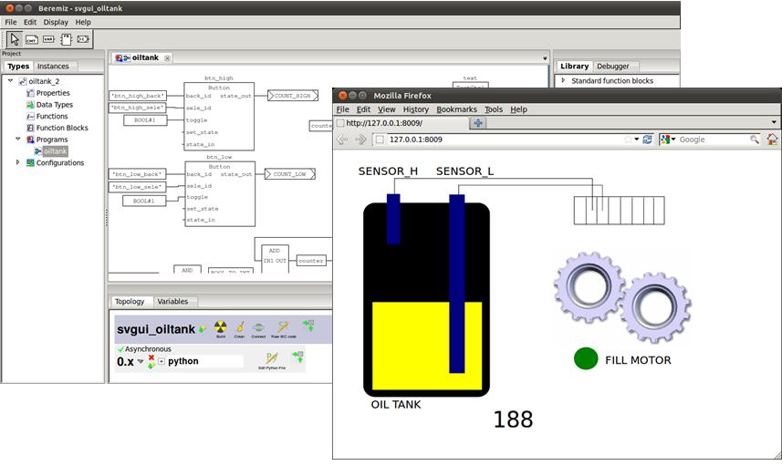

## Collected presentations and papers

### Xenomai User Meeting 2009

`E.TISSERANT "Beremiz Roadmap from CanFestival and MatPLC to Automforge.net"`

**Abstract:**

_The Beremiz PLC programming environment originally involved developers of the
CanFestival free CANopen stack and MatPLC projects. The project has been
initiated in order to fill the gap between free software and control
engineering._

_Today, thanks to Beremiz, automation users can easily connect IEC-61131 function
blocks across CANopen networks with Free Software. Industrials, teachers,
students and researchers use that GPL project, and actively contribute with new
features every day._

_But what about the PLC programs they produce? Could PLC programming also benefit
from the Free Software ideology? A new Free Software Forge is to be held:
Automforge.net._

_In this presentation, are presented project's passed, present and future
milestones._

[pres-xum.pdf](pres-xum.pdf)

### IEEE INDIN 2007

`L.BESSARD, M.SOUSA, E.TISSERANT "An Open Source IEC 61131-3 Integrated Development Environment"`

A paper about Beremiz, going into some technical details on the compiler, and PLCopen editor.

**Abstract:**

_The IEC 61131-3 standard defines a common
framework for programming PLCs (Programmable Logic
Controllers), which includes the complete definition of four
programming languages and a state machine definition
language. Industrial PLC vendors are slowly offering support
for this standard, however small inconsistencies remain
between their implementations, transferring programs
between vendors is almost impossible due to different file
formats, and licenses are generally too expensive to allow
students do install these commercial solutions on their own
computers._

_To this end, the authors have developed an Integrated
Development Environment (IDE) for the IEC 61131-3
framework, which is being offered to the general public under
the GNU Public License (GPL). The IDE consists of a
Graphical User Interface (GUI) and a backend compiler.
Using the GUI the user may develop programs in any of the
four programming languages, as well as the state machine
definition language. The backend compiler is used to convert
these programs into equivalent C++ programs which may
later be compiled and executed on various platforms._

[Presentation slides](beremiz.pdf)

[Submitted paper](beremiz-paper-indin07.pdf)

### International CAN Conference 2008

`E.TISSERANT, L.BESSARD "Automated CanOpen PDO mapping of IEC 61131-3 Directly Represented Variables"`

**Abstract:**

_CiA DS-405 defines a way to publish variables of IEC 61131-3 programmables
CANOpen nodes through their Object Dictionary, using Dynamic Index Assignment
defined in DS-302. Correspondence between IEC 61131-3 variables and Object
Dictionary entries is let to the responsibility of the PLC manufacturer._

_IEC 61131-3 defines some Directly Represented Variables, specifying direction, size,
and location of physical variables. In this representation, location is an arbitrary count
of integers separated by dots. Again, correspondence between location of IEC 61131-3
and physical variables is manufacturer-specified._

_As a consequence, and despite of the standardization efforts of PLCopen and CiA,
there is still no real interchangeability of PLC nodes in a CANopen network.
This paper proposes a method for the PLC application writer to explicitly publish
and subscribe to CanOpen remote variables with Directly Represented Variables
location. As a complement to DS-405, it could suppress most network reconfiguration
steps when moving PLC programs from one brand to another._

_Presented concepts and algorithms are already implemented in the Beremiz and
CanFestival open source projects, and are publicly available._

[Presentation slides](ICC_slides.pdf)

[Submitted paper](icc07-ver1.pdf)

### University of Porto 2018

```
Title: OPC UA support for Beremiz softPLC
Author: Martim Afonso Maia Henriques da Silva
Supervisor: Mário Jorge Rodrigues de Sousa
Year: 2018
Organization: University of Porto
Location: Porto, Portugal
```

[Report](https://repositorio-aberto.up.pt/bitstream/10216/115498/2/284527.pdf) 


### St. Petersburg Polytechnic University 2018

```
Title: Performance comparasion different IEC 61131-5 softPLC runtimes
Author: Nitochkin A. P.
Supervisor: Loginov A. L.
Year: 2018
Organization: St. Petersburg Polytechnic University
Location: St. Petersburg, Russia
```
[Report.pdf](http://elib.spbstu.ru/dl/2/v18-917.pdf/download/v18-917.pdf?lang=en)

### I.S.Bruk Institute for Electronic Control Computers 2017

```
Title: Beremiz application for Milandr K1986BE1QI microcontrollers
Author: Plugnova Tatiana S.
Year: 2017
Organization: I.S.Bruk Institute for Electronic Control Computers
Location: Moscow, Russia
```

[Article](https://elibrary.ru/item.asp?id=30754123)

### Korean Institute of Electrical Engineers 2017

```
Title: Development and Analysis of Korea Open Source Motion System based on Real-Time Ethernet
Author: Sun Lim, Seung-Yong Lee, Ji-Hyun Kim, Il-Kyun Jung
Year: 2017
Organization: Korean Institute of Electrical Engineers
Location: South Korea
```

[Article](http://koreascience.or.kr/article/JAKO201711437354824.page)
[Paper.pdf](http://ocean.kisti.re.kr/downfile/volume/kiee/DHJGII/2017/v66n1/DHJGII_2017_v66n1_186.pdf)

### University of Seoul 2017

```
Title: OPC-UA Communication Framework for PLC-Based Industrial IoT Applications
Author: Woonggy Kim, Minyoung Sung
Year: 2017
Organization: The University of Seoul
Location: Seoul, South Korea
```

[Article](https://ieeexplore.ieee.org/abstract/document/7946910/)


## Saint Petersburg Electrotechnical University 2016

```
Title: Development of an information model for storing information about control systems hardware, and methods for integration this in Beremiz IDE
Author: David Rodionov
Supervisor: Nikonov A. N.
Year: 2016
Organization: Saint Petersburg Electrotechnical University
Location: St. Petersburg, Russia
```

[Report.pdf](http://library.eltech.ru/files/vkr/specialisti/0831/2016%D0%92%D0%9A%D0%A0033119%D0%A0%D0%9E%D0%94%D0%98%D0%9E%D0%9D%D0%9E%D0%92.PDF)


### Huazhong University of Science & Technology 2014

```
Master thesis: research on Prototype Developing Environment for CNC System Based on IEC61131-3
Author: Song Lizhi (宋立志)
Supervisor: Zhou Huicheng (周会成)
Year: 2014
University: Huazhong University of Science & Technology
Location: Wuhan, Hubei, China
```

[Report](http://gb.oversea.cnki.net/kcms/detail/detail.aspx?recid=&FileName=1014025725.nh&DbName=CMFD2014&DbCode=CMFD&uid=WEEvREcwSlJHSldRa1Fhb09jMjQxYzdOaVZwVldzaHBleE1kN2FKV2x0VT0=$9A4hF_YAuvQ5obgVAqNKPCYcEjKensW4ggI8Fm4gTkoUKaID8j8gFw!)


### University of Seoul 2013

```
Title: An open-source development environment for industrial automation with EtherCAT and PLCopen motion control
Authors: Ikhwan Kim, Taehyoun Kim, Minyoung Sung, Edouard Tisserant, Laurent Bessard, C. Choi
Year: 2013
Conference: Emerging Technologies & Factory Automation (ETFA) IEEE 18th Conference
Location: Cagliari, Italy
```

[http://ieeexplore.ieee.org/document/6648122/](http://ieeexplore.ieee.org/document/6648122/)


### University of Porto 2011

Beremiz used as maintool to automate manufacturing line.

```
Master thesis: Automation of the Manufacturing Line Flexible DEEC
Author: Daniel André da Silva Petim Batista
Supervisor: Professor Doutor Mário Jorge Rodrigues de Sousa
University of Porto, Portugal
```

[FinalReport.pdf](http://paginas.fe.up.pt/~ee05042/FinalReport.pdf)

### Korea Institute of Industrial Technology 2015

```
Title: Can we use Beremiz real-time engine for robot programmable logic controller?
Authors: S. Chu, E. Shin, S. Lee, K. Lee, K. Nam
Organization: Korea Institute of Industrial Technology, South Korea
```

[IEEE publication](http://ieeexplore.ieee.org/document/7378375/)

### Chalmers University of Technology 2010

```
Master thesis: Implementation of a software tool for development, specification and verification of logic control programs
Author: Massoud Alahdini
Organization: Chalmers University of Technology, Sweden
```

[PDF](http://publications.lib.chalmers.se/records/fulltext/126177.pdf)

To build the above mentioned tool, PLCOpenEditor has been extended to support RAC and formal verification using Cadence SMV.

### Technische Universität Dresden 2012

```
Title: Programming embedded devices in IEC 61131-languages with industrial PLC tools using plcopen xml
Authors: Markus Simros, Stefan Theurich, Martin Wollschlaeger
Organization: Technische Universität Dresden, Germany
```

[ResearchGate](https://www.researchgate.net/publication/272773580_Programming_embedded_devices_in_IEC_61131-languages_with_industrial_PLC_tools_using_PLCopen_XML)

Paper was written for 10th Portuguese Conference on Automatic Control. They added java backend to matiec and reused plcopen algorithms from Beremiz.

### RWTH Aachen University 2011

```
Bachelor thesis: Translation of Sequential Function Charts to Transition Systems
Authors: Hauke Schaper
Supervisors: Prof. Dr. Katoen, Prof. Dr. Epple
Organization: RWTH Aachen University, Germany
```

[Thesis](http://www-i2.informatik.rwth-aachen.de/pub/index.php?type=download&pub_id=767)

They used Beremiz as a tool to create/edit PLCopen schemes for verification tool.

### University of Seoul 2013

```
Title: Toward a Holistic Delay Analysis of EtherCAT Synchronized Control Processes
Authors: Minyoung Sung, Ikhwan Kim, and Taehyoun Kim
Organization: University of Seoul, South Korea
```

[Publication](http://univagora.ro/jour/index.php/ijccc/article/view/384)

```
Title: Implementation and Validation of EtherCAT Support in Integrated Development Environment for Synchronized Motion Control Application (Korean)
Authors: Jongbo Lee, Chaerin Kim, Ikhwan Kim, Youngdong Kim, Taehyoun Kim
Organization: University of Seoul, South Korea
```

[Publication](http://www.koreascience.or.kr/article/ArticleFullRecord.jsp?cn=DHGGCI_2014_v38n2_211)

## University of Minho 2015

```
Title: Validation of IEC 61131-3 Programmable Logical Controllers in KeYmaera
Author: Yoan David Ribeiro
Organization: University of Minho, Portugal
```

[Paper](http://mei.di.uminho.pt/sites/default/files/dissertacoes/eeum_di_dissertacao_pg25340.pdf)

Another SFC validation is done using Beremiz. In this work annotation are placed in comments on SFC scheme.

## Collected demonstrations

### Open Software Platform for Automation (2012)

Under a government-funded project, [SSLab](http://ssl.uos.ac.kr) and [RTES lab](http://rtes.uos.ac.kr) are cooperating with mechanical industry to enable an open software platform for automation:



- "Synchronous control drive for the multi axial drive and the high power
servo-motor" project funded by MKE, Korea

- PC-based automation system using EtherCAT, an industrial real-time
Ethernet standard.

- Open source software incl. Linux/Xenomai, Beremiz, and Etherlab EtherCAT
master.

- Comformance with international standard: IEC 61131-3, CiA302, CiA402,
and IEC 61158.

- HTML5-based vector-graphics human interface.

- Wireless HMI

- Incorporation of computer vision (OpenCV) in automation.

[](https://www.youtube.com/watch?v=e6Y9XpLRlWo)

Video shows the demonstration of SmartCart, an electric cart that
has been developed using Beremiz for performance evaluation. It is equipped
with two Maxon drives controlled via CANopen interface. Users are able to steer
the cart using gyro in his Android phone.

### Free Software for Six Degrees Of Freedom motion (2009)

[](https://www.youtube.com/watch?v=pA9w0MKpbC8)

This video present a free software based machine made in collaboration with FESTO for LAAS.

LAAS is a French Scientific Research Lab involved in many scientific areas, mostly related computer and robotics.

For some computer vision experiments, this lab needed a positioning machine able to work within one cubic meter space with 6 degrees of freedom, and with 20ms time accuracy.

Motion control software had to be fully open so that researchers could have full control over positioning.

Realization involved six CANopen servo drives, and one industrial PC acting as a CANopen CNC, running real-time Linux, CanFestival and Beremiz.

As an input device for manual control mode, we used a wiimote.

[http://www.canfestival.org](http://www.canfestival.org)

[http://www.festo.com](http://www.festo.com/)

[http://www.laas.fr](http://www.laas.fr/)


### The Open Source Coffee Machine (2008)

The Open Source Coffee Machine is a recycled coffee machine, controlled
by a PC running Beremiz, and using some MicroMod CANopen I/O nodes from
Peak-System. This machine have been prepared in collaboration with Peak-System
for SCS-Paris-08 exhibition. It served Free coffees during 4 days on
Peak-System's booth and have been donated to IUT of Saint-Dié-des-Vosges
so that students can have fun practising automation.

[](https://www.youtube.com/watch?v=SkzLKTBTbSk)

[http://www.peak-system.com](http://www.peak-system.com)


## Collected user manuals

### From INEUM

Russian company [INEUM](http://www.ineum.ru/) has made excelent documentation for their PLCs. It is available on their
[website](http://www.sm1820.ru/2018/01/04/beremiz/).
This [user manual](http://www.sm1820.ru/files/beremiz/beremiz_manual.pdf)
is written for INEUM's SM1820M PLC series, but there are lot of
information on how to use Beremiz.

[Russian version](https://sm1820.github.io/beremiz/) is already done. Documentation source is available [here](https://github.com/sm1820/beremiz/tree/master/doc/usage_guide).

Until English version is ready, please use machine-translated [user manual](https://translate.google.com/translate?hl=&sl=ru&tl=en&u=https%3A%2F%2Fsm1820.github.io%2Fberemiz%2F).

### From Smarteh

This
[user manual](LpcManager_UserManual.pdf)
applies to Smarteh's LPC and LPC-2 controllers, but reader can find
relevant information on how to use Beremiz in general.

### From LOLITECH

The
[manual](beremiz_user_manual_lolitech.pdf)
is outdated and kept for historical reasons.

## Collected articles

### INEUM 

`I. Baranov "Development approaches of human-machine interface used for monitoring and control applied programs running at computation systems based on Sparc and Elbrus microprocessors in industrial automation" (Russian)`

The article contains overview of existing HMI function blocks and description
of steps needed to create new function block for a custom HMI element.

[ineum.ru](http://www.ineum.ru/files/51cc3d/896487/1a8d34/000000/baranov_i.a._-_podhody_k_razrabotke_cheloveko-mashinnogo_interfejsa_kontrolya_i_upravleniya_prikladnymi_programmami_dlya_vk_s_mikroprotsessorami_sparc_i__elbrus__v_oblasti_asutp.doc)

`I. Baranov, А. Glukhov "Open international IEC-61131 standard compliant programming languages for computation systems based on Russian Sparc architecture microprocessors" (Russian)`

Article contains short description about how to create own plugins for Beremiz :

[ineum.ru](http://www.ineum.ru/files/51cc3d/276487/1ad734/000000/baranov_gluhov-yazyki_standarta_iec-61131_dlya_vychislitelnyh_kompleksov_na_baze_otechestvennyh_mikroprotsessorov_s_arhitekturoj_sparc.doc)

`I. Baranov "Software development for computation systems based on Russian sparc architecture microprocessors using open international IEC 61131-3 standard" (Russian)`

[ienum.ru](http://www.ineum.ru/razrabotka-prikladnykh-programm-dlya-vk-na-baze-otechestvennykh-mikroprocessorov-s-arkhitekturoj-sparc)

`V. Glukhov, K. Trushkin "Control Systems based on industrial computers from INEUM" (Russian)`

[atomeks.ru](http://www.atomeks.ru/mediafiles/u/files/pr-at2012/MCST.PDF)

### easyelectronics.ru

[Beremiz - free software IDE for PLC (part 1) (Russian)](http://we.easyelectronics.ru/plc/beremiz-svobodnaya-sreda-programmirovaniya-plk-chast-1.html)

[Beremiz - free software IDE for PLC (part 2) (Russian)](http://we.easyelectronics.ru/plc/beremiz-svobodnaya-sreda-programmirovaniya-plk-chast-2.html)

### altlinux.org

[ALT-Review journal, Beremiz (Russian)](https://www.altlinux.org/Beremiz)

## Collected Screen Casts

### Beremiz' 2009 Screen Cast

[beremiz\_screencast\_2009.flv](beremiz_screencast_2009.flv)

### Beremiz' 2007 Screen Cast

Old screen cast. Keep it for the record :-)

[beremiz.ogg](beremiz.ogg)

