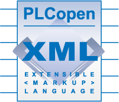
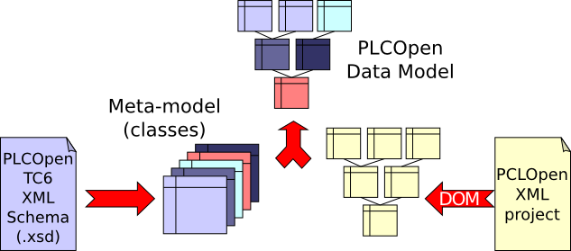
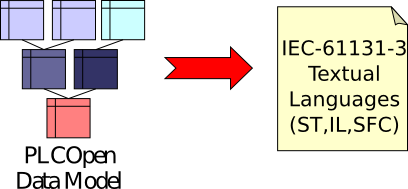
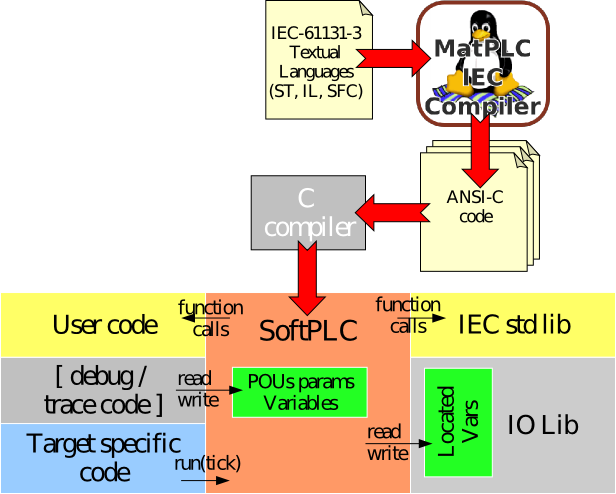

### Overview

Own [project's documentation](https://beremiz.readthedocs.io) is still sparse. 

There are many [collected documents and publications ](/collect) contributed along years.

There is also a page for [screenshots](/screenshots), as well as a [youtube channel](https://www.youtube.com/channel/UCcE4KYI0p1f6CmSwtzyg-ZA).

### Presentation

Please follow links hereafter to see an animated presentation of Beremiz :
[English](http://dev.automforge.org/beremiz_docs/raw-file/tip/BeremizOverview.en.svg),
[Russian](http://dev.automforge.org/beremiz_docs/raw-file/tip/BeremizOverview.ru.svg)

Presentations are animated SVG. It's recommended to view them in Firefox (Chrome doesn't support SVG animation anymore). Screenscasts of presentations are available on [youtube](https://www.youtube.com/watch?v=1AA-kdUkwlE).

PDF version of English presentation without animation is available
[here](https://bitbucket.org/automforge/beremiz_docs/raw/tip/BeremizOverview.en.pdf).

### The PLCopen Editor

A GUI that let PLC programmer write programs according to IEC-61131-3 and
conform to PLCopen XML

The PLCopen Editor saves and loads XML projects accordingly to [PLCopen TC6-XML Schemes](http://www.plcopen.org/pages/tc6_xml/).

{: .center-image }

Data-model is based on the official TC6-XML XML Schema. The official .xsd
file is used at startup to create a kind of meta model, that define relations
between objects inside the PLCopen model. Thanks to this feature, PLCopen Editor
can also be used as a PLCopen TC6-XML validator.

{: .center-image }

PLCOpen editor has built-in export filter that convert graphical languages to
their equivalent textual form.

{: .center-image }

### The IEC to C compiler

Compiles textual forms of IEC-61131-3 to C code.

Originally started in 2002 by Mario de Sousa (U-Porto) as a ST/IL->C++ compiler
for the MatPLC project, this compiler have found a new place to grow inside
Beremiz.

Now MatIEC works this way:

- Compiles ST/IL/SFC code into ANSI-C code.
- All POU parameters and variables are accessible through nested C structs
- Located variables are declared as extern C variables

{: .center-image }

## Standards

### IEC 61131

[IEC-61131-3](https://en.wikipedia.org/wiki/IEC_61131-3) is a normative document
provided by the standards organization IEC (International Electrotechnical Commission)
and describing a standard for implementing programmable controllers.

The part 3 of this document (commonly named IEC 61131-3) specifies syntax and semantics for programming language for programmable controllers. Beremiz implements all the languages described in this document.

[http://www.iec.ch](http://www.iec.ch)

### PLCopen

PLCopen is a vendor and product-independent worldwide association defining international standards for various topics related to control programming. For this purpose, PLCopen has 6 technical committees.

The goal of the [sixth committee (TC6)](http://www.plcopen.org/pages/tc6_xml/) is to define a standard file format, based on XML, for exchanging programmables controllers programmed using IEC 61131-3 languages. Beremiz uses this file format for saving the PLCprograms of projects.

[http://www.plcopen.org](http://www.plcopen.org)

### CANopen

[CANopen](https://en.wikipedia.org/wiki/CANopen) is a communication protocol and device profile specification for embedded systems used in automation.

CANopen is a CAN-based communication system. It comprises
higher-layer protocols and profile specifications. CANopen has been
developed as a standardized embedded network with highly flexible
configuration capabilities. It was designed originally for
motion-oriented machine control systems, such as handling systems.
Today it is used in various application fields, such as medical
equipment, off-road vehicles, maritime electronics, railway
applications, or building automation.

The way Beremiz links IEC-61131 and CANopen is described it this [paper](/collect#international-can-conference-2008).

### OPC-UA

OPC Unified Architecture (OPC UA) is a cross-platform, open-source, IEC62541 standard for data exchange from sensors to cloud applications developed by the [OPC Foundation](https://opcfoundation.org/). 

Beremiz' OPC-UA Client support allows programmer to browse OPC-UA server directly in Bermiz IDE thanks to [FreeOpcUa](https://github.com/FreeOpcUa)'s [python-opcua](https://github.com/FreeOpcUa/python-opcua).
C code is generated so that runtime links with [open62541 OPC-UA stack](https://github.com/open62541/open62541) to collect and change values of selected server’s variables.

### Modbus

Modbus is a data communications protocol originally published by Modicon (now Schneider Electric) in 1979 for use with its programmable logic controllers (PLCs). Modbus has become a de facto standard communication protocol and is now a commonly available means of connecting industrial electronic devices. 

Beremiz' Modbus client and server support relies on [Modbus library](https://hg.beremiz.org/Modbus) for Beremiz and Matiec written by Mario de Sousa. All object types are supported, as client or server, on both TCP/IP and serial.

### EtherCAT

EtherCAT (Ethernet for Control Automation Technology) is an Ethernet-based fieldbus system invented by Beckhoff Automation. The protocol is standardized in IEC 61158 and is suitable for both hard and soft real-time computing requirements in automation technology. 

Beremiz uses [EtherLab's EtherCAT master](https://gitlab.com/etherlab.org/ethercat).



TODO !!

### BACnet

### HTML5 SVG


