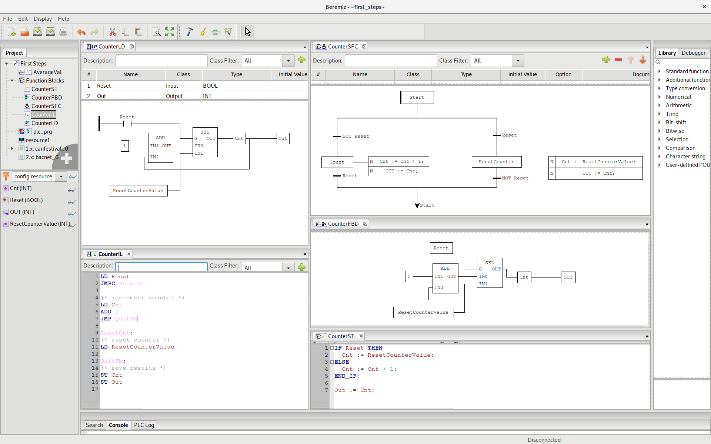

Welcome to Beremiz project's homepage.

Beremiz is [Free Software](https://en.wikipedia.org/wiki/Free_software) for machine automation.

It conforms to [IEC-61131](https://en.wikipedia.org/wiki/IEC_61131-3) among other [standards](doc#standards).

{: .center-image }

This site collects use cases, documentations, publications and news about Beremiz and its development.

For professional support, quality insurance and production ready hardware, please reach [Beremiz SAS](https://beremiz.fr).
