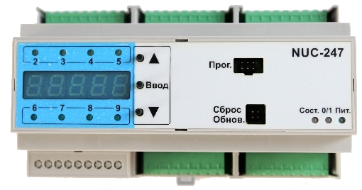

## Automation products

### Smarteh (Slovenia/Tolmin)

[Smarteh](http://www.smarteh.si)
has multiples lines of Beremiz-based PLC with several models.

| [LPC-2.MC8](https://www.smarteh.com/wp-content/uploads/2020/12/225mc813001002_lpc2_mc8_usrman.pdf) implements an efficient bare metal C runtime, including TCP Modbus server, CANopen (with [CanFestival](http://www.canfestival.org)) as well as simple HTTP server. LPC-Composer tool helps in assembling I/O modules from [LPC2 catalog](https://www.smarteh.com/products/building-automation-product-line/lpc-2-programmable-controllers/) intuitively. |  |
| [LPC-2.MC9](https://www.smarteh.com/wp-content/uploads/2020/12/225mc915001001_lpc2_mc9_usrman.pdf) CPU module, offers improved performance, scalability and a wide range of new features within a single compact package.   Module is based on ARM architecture processor running GNU/Linux and adds more computing power, more control and additional interfaces. |  |
| Additionally to classical PLC CPU modules the [LPC-3 line](https://www.smarteh.com/products/industrial-automation/) introduces Beremiz-based industrial automation controllers. | [LPC-3.IOR, LPC-3.IOT, LPC-3.IOU](https://www.smarteh.com/products/industrial-automation/lpc-3-programmable-controllers/main-modules/)       [LPC-3.GOT.001](https://www.smarteh.com/wp-content/uploads/2020/12/226got14001001_lpc3_got-001_usrman-1.pdf)        [LPC-3.GOT.011](https://www.smarteh.com/wp-content/uploads/2020/12/226gotxx01100x_lpc3_got-011_usrman-1.pdf)    |

For more details visit [www.smarteh.si](http://www.smarteh.si).

### Nucleron R&D LCC (Russia/Perm)

[Nucleron](http://www.nucleron.ru/) has developed YAPLC platform which is a set of Beremiz extensions called YAPLC/IDE and a bare metal PLC runtime system called YAPLC/RTE. The company has a [GitHub account](https://github.com/nucleron) where you can find the platform.

They also offer YAPLC based product line of [progammable relays](https://nucleron.ru/programmable-relays/)
which may be programmed with a serial connection
cable ( [NUC-246](https://nucleron.ru/adapter-nuc-246/)).

| [NUC-242](https://nucleron.ru/nuc-242-220/) | [NUC-243](https://nucleron.ru/nuc-243-220/) | [NUC-247](https://nucleron.ru/nuc-247-220/) |
|                     |                     |                     |

## Nefteavtomatika (Russia/Ufa)

Source code for target-specific Beremiz extensions is available in their [public repository.](https://github.com/yanvasilij/IDE)

| [MKLogic200 (ARM, Cortex-M4)](https://www.nefteavtomatika.ru/en/sup/industrial-automation-facilities-and-systems/plk/plc-of-mklogic-200-series/) |  |

### INEUM (Russia/Moscow)

The company has a [GitHub account](https://github.com/sm1820) where you can find some source code for Beremiz and matiec and [gh-pages](https://sm1820.github.io/beremiz/) with Beremiz user documentation.

| [KMAV-S (ARM, Cortex-M0)](http://www.sm1820.ru/2018/01/13/kmavs/) | [MP-10 (ARM, ARM926)](http://www.sm1820.ru/old/prod/programmiruemye-logicheskie-kontrollery/item/1-protsessornye-moduli-micro-pc/2-cpu-mp10.html) | [MP-8 (x86)](http://www.sm1820.ru/old/prod/programmiruemye-logicheskie-kontrollery/item/1-protsessornye-moduli-micro-pc/1-mp-8.html) |
|  |  |  |

There are series of communication controllers, that can be driven by Beremiz as well.

| [BPI-2 (ARM, Cortex-A5)](http://www.sm1820.ru/2018/01/04/bpi-2/) | [BPI-2.3 (ARM, Cortex-A5)](http://www.sm1820.ru/2018/03/28/358/) |
|  |  |

### Argo (Russia/Ivanovo)

| [MUR 1001.3 SV (ARM, Cortex-M3)](http://argoivanovo.ru/catalog/index.php?IBL=22&ID=184120) |  |

### NGPInform (Russia/Ufa)

| [CILK PAC (ARM, Cortex-A8)](http://ngpinform.ru/means/programmiruemye-kontrollery-i-raspredelennye-sistemy-vvoda-vyvoda/modulnye-plk/) |  |
| [CILK (ARM, Cortex-M3)](http://ngpinform.ru/means/programmiruemye-kontrollery-i-raspredelennye-sistemy-vvoda-vyvoda/kompaktnye-plk/) |  |

### KOSMOS (South Korea)

| [KOSMOS](http://kosmos.keti.re.kr) stands for Korea Open Source MOtion System. It was developed for [HIGEN Motor](http://www.higenmotor.com) in collaboration with [KETI](https://www.keti.re.kr) (Korea Electronics Technology Institute). |  |

## Embedded software development

#### [OposSOM](https://www.opossom.com)

OposSOM (Armadeus systems) develops and produces System On Modules with embedded Linux combining small size with low energy consumption and extended connectivity. 

|   | Armadeus boards come with full Linux development environment using Buildroot. Beremiz runtime is proposed as an installable package in Armadeus' [software](https://sourceforge.net/projects/armadeus/). |

Armadeus Project is also an active community with mailling-list, irc channel ([irc://libera.chat/#Armadeus](irc://libera.chat/#Armadeus)) and [wiki](http://www.armadeus.org/wiki).

#### STM32Discovery boards

Nucleron's [repositories](https://github.com/nucleron/) on github (current maintainer Paul Beltyukov) have support for STM32Discovery boards.
